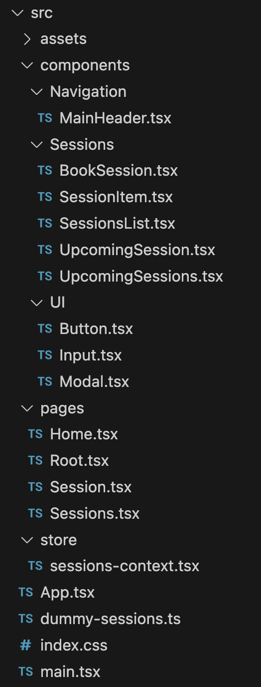

# Hints

Building this complete project from scratch can definitely be challenging - therefore, you'll find a couple of hints below.

## Take A Peek At My Solution

As mentioned, this is a challenging task - and it's meant to be!

But it should not become a frustrating experience.

If you're getting stuck and you have no idea on how to proceed, you should take a brief look at my solution. Because you don't have to go through the entire solution - instead, you can take a look at the component or part you're currently stuck at.

## My Project Structure
You can structure your project however you want!

But to give you an idea of my solution structure (and the components I decided to build), you find a screenshot of my finished structure below:



## Take A Look At `index.css`

When it comes to deciding which component should render which JSX code, it might be helpful to explore the `index.css` file I'm providing to you.

You can, of course, render any JSX structure of your code and you can also set up your own styles. That's perfectly fine!

But by exploring the `index.css` I provided to you, you might get an idea of the rough JSX / HTML structure I planned for.

## React Router & TypeScript

Using React Router generally requires no special types or configuration when using it with TypeScript in a React project.

But there are two note-worthy things you should be aware of when working on this project.

### Type-safe Route Params

If you need to extract route params, you can take advantage of the fact that `useParams` is a generic function - you can (optionally!) pass your route params type for a given route to `useParams`: `const params = useParams<{ id: string }>();` => this would give you better type & IDE support when then accessing `params.id`.

### Getting Hold of LinkProps

For building a flexible, custom `Button` component that should either output a `<Link>` or a `<button>`, it might be useful to get hold of the default props accepted by the `Link` component provided by `react-router-dom` => Thankfully, React Router exposes the type for these props and you can get hold of it like this: `import { type LinkProps } from 'react-router-dom';`

## Building a Custom Modal Component

For this project, you should build a custom `Modal` component that renders the built-in `<dialog>` element and calls the `openModal()` method on that element whenever an exposed `open()` method is triggered from outside the `Modal` component.

To call the built-in `openModal()` method on `<dialog>`, you'll need to use a ref that's connected to `<dialog>` (from inside the `Modal` component).

To expose a callable `open()` method that then calls `openModal()` on `<dialog>`, you'll need to use the `useImperativeHandle()` Hook inside the `Modal` component.

## Getting User Input

You'll need to get user input when a user is "booking a session".

You can get that input in three main ways:

1. Use `useState()` and two-way-binding

2. Use Refs (via `useRef()`)

3. Use the built-in `FormData` class

In my solution, I'll use the built-in `FormData` class to let the browser help me. By using `new FormData(form)`, you'll automatically get an object that gives you access to the data entered by the user.

You'll have to make sure that you did assign the name prop to every `<input>` (or, in this app: `<Input>`, since you should build a custom wrapper `Input` component). Because only inputs with a name will be registered in the object created by `FormData`. You can then use the name to get hold of the entered value:

```js
const fd = new FormData(form);

const enteredEmail = fd.get('email');
```

Or:

```js
const fd = new FormData(form);
const data = Object.fromEntries(fd);
const enteredEmail = data.email;
```
